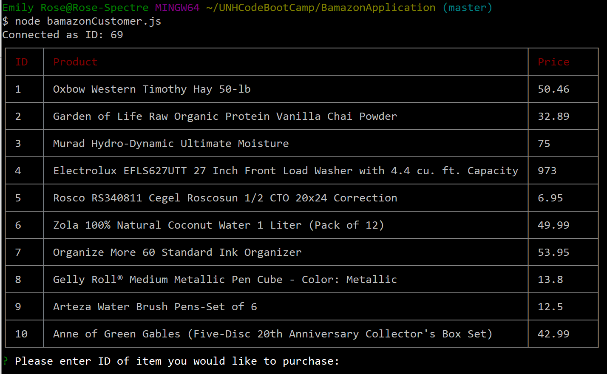
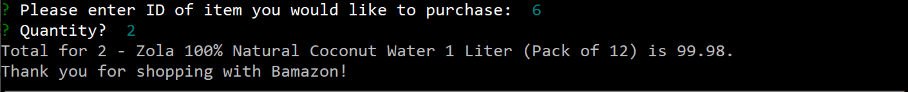
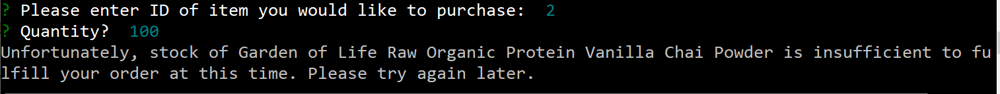

# BamazonApplication
Bamazon is an Amazon-like storefront that works with the command line node app, which takes in parameters and gives back data from a SQL database.  Users will be shown items available for purchase. They will specify which products they want want to purchase by product ID and quantity.  If enough stock is available, they will be told their total and thanked for their purchase.  Otherwise they will be told there is not enough available at the time, and to try back at another time. 

# How to use
1. Open a console app such as Bash.
2. Navigate to the `bamazonCustomer.js` file in `BamazonApplication/assets/javascript/`
3. Enter the following command:
    * `node bamazonCustomer`
        * Results: Items in the Bamazon inventory will be displayed along with a prompt to enter the ID of the item you would like to purchase
            
        * You will then be prompted to enter the quantity
            
        * If your purchase request is successful, you will be see a confirmation   
            
        * If your purchase request is not successful, you will be see a cancellation   
            
        * Updated Bamazon inventory will be displayed following each message returned   

### [Try the App!](https://github.com/Edestiny7/BamazonAppication)

Technology: JavaScript | Node.js | Git | mySQL